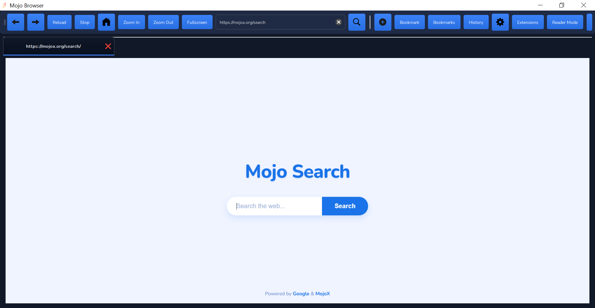
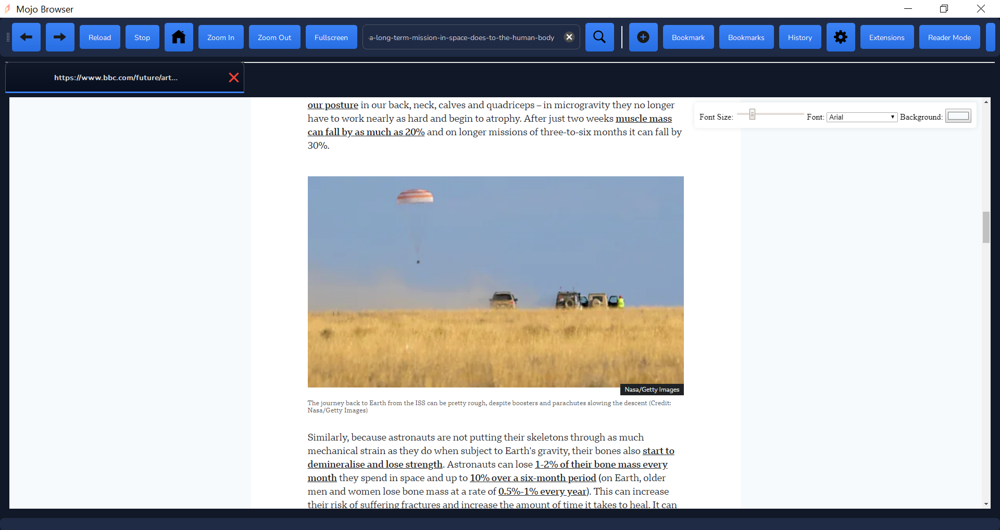

# Mojo Browser

[](LICENSE)
[](https://github.com/Muhammad-Noraeii/Mojo-Browser/releases)
[]()  
[]() 

**A privacy-focused web browser built with PyQt5 and Python.**

Mojo Browser is designed to provide a secure and customizable browsing experience with a strong emphasis on user privacy.  It includes features such as tracker blocking, , fingerprint protection, HTTPS enforcement, and proxy support.  It's also extensible through a JavaScript-based extension system (MojoX). This is an alpha release, so expect bugs and incomplete features.

## Table of Contents

* [Features](#features)
* [Screenshots](#screenshots)
* [Installation](#installation)
    * [Prerequisites](#prerequisites)
    * [From Source](#from-source)
    * [Using a Pre-built Package (Future)](#using-a-pre-built-package-future)
* [Usage](#usage)
* [Extensions (MojoX)](#extensions-mojox)
* [Configuration](#configuration)
* [Privacy Features](#privacy-features)
* [Keyboard Shortcuts](#keyboard-shortcuts)
* [Contributing](#contributing)
* [Roadmap](#roadmap)
* [License](#license)
* [Credits](#credits)
* [Contact](#contact)


## Features

*   **Privacy-Focused:**
    *   Tracker and (configurable).
    *   Do Not Track (DNT) support.
    *   Third-party cookie blocking.
    *   HTTPS-only mode.
    *   Fingerprint protection.
    *   Proxy support (including random proxy selection from a list).
    *   Clear data on exit (optional).
    *   Private browsing mode.
*   **Customizable:**
    *   Dark, Light, and System themes.
    *   Multiple search engine options (Lilo, Mojeek, Google, Bing, DuckDuckGo, Yahoo, Ecosia, Qwant, Brave, SearchXNG).
    *   Configurable home page.
    *   Configurable new tab behavior (Home Page, Blank Page, Last Page).
    *   JavaScript control (enable/disable).
    *   Pop-up blocking.
    *   Mixed content blocking.
*   **Usability:**
    *   Tabbed browsing with tab renaming, duplication, and pinning.
    *   Bookmarks and history management.
    *   Download manager with progress display, pause/resume, and cancellation.
    *   Zoom in/out functionality.
    *   Fullscreen mode.
    *   Reader mode (requires JavaScript).
    *   System tray integration.
    *   User profile switching.
*   **Performance:**
    *   Hardware acceleration (optional).
    *   Page preloading (optional).
    *   Configurable cache size limit.
    *   Inactive tab suspension.
    *   Periodic performance optimization (garbage collection).
*   **Extensibility:**
    *   JavaScript extension support (MojoX) with a dedicated extension store interface.
    *   Ability to download extensions from URLs.

## Screenshots



*Main Window (Dark Theme)*


*Settings Dialog*


*Extensions Dialog*


*Reader Mode*

## Installation

### Prerequisites

*   Python 3.7+ (3.9+ recommended)
*   PyQt5 (including QtWebEngineWidgets): `pip install PyQt5 PyQtWebEngine`
*   requests: `pip install requests`
*  If using virtualenv(recomended): `pip install virtualenv`

### From Source

1.  **Clone the repository:**

    ```bash
    git clone https://github.com/Muhammad-Noraeii/Mojo-Browser.git
    cd Mojo-Browser
    ```

2.  **Create a virtual environment (recommended):**

    ```bash
    python3 -m venv venv
    # On Windows
    venv\Scripts\activate
    # On macOS/Linux
    source venv/bin/activate
    ```

3.  **Install dependencies:**

    ```bash
    pip install -r requirements.txt 
    ```
    (Create a `requirements.txt` file with the following content):

    ```
    PyQt5
    PyQtWebEngine
    requests
    ```

4.  **Run the browser:**

    ```bash
    python main.py
    ```

### Using a Pre-built Package (Future)

*   Download links for pre-built packages (Windows, macOS, Linux) will be provided here in future releases.  Instructions for installation using package managers (e.g., `apt`, `pacman`, `brew`) may also be included.

## Usage

After launching the browser, you can:

*   Enter URLs in the address bar and press Enter.
*   Use the toolbar buttons for navigation (back, forward, reload, home).
*   Open new tabs with Ctrl+T (Cmd+T on macOS).
*   Close tabs with Ctrl+W (Cmd+W on macOS).
*   Manage bookmarks and history from the toolbar.
*   Open the settings dialog from the toolbar to customize the browser.
*   Manage extensions from the toolbar.
*   Right-click on web pages for context menu options.

## Extensions (MojoX)

Mojo Browser supports JavaScript-based extensions.  You can:

*   **Manage Extensions:** Open the Extensions dialog from the toolbar to enable, disable, and download extensions.
*   **Download Extensions:** Download extensions directly from URLs or browse the MojoX extension store within the Extensions dialog.  Extensions are saved in the `extensions` subdirectory.
*   **Extension Store:** The "Get from MojoX" button fetches a list of extensions from `https://mojox.org/MojoBrowser/Assets/js/scripts.js`.  This file should contain a JSON array of extension objects, each with `name`, `description`, `author`, and `url` properties.
*  **Automatic Injection:** Enabled extensions are automatically injected into each web page (if JavaScript is enabled).

**Important:**  Exercise caution when installing extensions from untrusted sources.  Inspect the JavaScript code before enabling them.

## Configuration

Browser settings are stored in the `settings.json` file.  Bookmarks are stored in `bookmarks.json`, and history in `history.json`.  Privacy settings (related to blocking, tracking, etc.) are stored in `privacy_settings.json`.  The extension status (enabled/disabled) is stored in `extension_status.json`, and an extension cache is kept in `extension_cache.json`.  Proxy cache is stored in `proxy_cache.json`.  These files are created automatically in the application's directory.  You can modify these files manually, but be careful to maintain the correct JSON format.

## Privacy Features

Mojo Browser offers several layers of privacy protection:

*   **HTTPS Enforcement:** Attempts to upgrade HTTP connections to HTTPS.
*   **Tracker Blocking:** Blocks requests to known tracking domains.
*   **Third-Party Cookie Blocking:** Prevents third-party cookies from being set.
*   **Do Not Track:** Sends a "Do Not Track" header with each request.
*   **Fingerprint Protection:** Includes basic canvas fingerprinting protection and user-agent spoofing.  More advanced fingerprinting protection techniques are planned.
*   **Proxy Support:** Allows the use of HTTP proxies to mask your IP address. Includes a built-in list of proxies and automatically tests their availability.
*   **Private Browsing Mode:**  Does not save browsing history, cookies, or cache data.
* **Clear Data on Exit:** Option to clear all private data when the browser is closed.
*   **Permissions Management:**  The framework for site-specific permissions (e.g., cookies, JavaScript) is implemented, but the UI for managing these permissions is not yet complete.

## Keyboard Shortcuts

| Shortcut          | Action                      |
| ----------------- | --------------------------- |
| Ctrl+T            | New Tab                     |
| Ctrl+W            | Close Tab                   |
| Ctrl+R / F5       | Reload                      |
| Ctrl+H            | View History                |
| Ctrl+B            | View Bookmarks              |
| Ctrl+Q            | Quit                        |
| Ctrl+=            | Zoom In                     |
| Ctrl+-            | Zoom Out                    |
| F11               | Toggle Fullscreen           |
| Ctrl+Tab          | Switch to Next Tab          |
| Ctrl+Shift+T      | Reopen Last Closed Tab      |
| Ctrl+Shift+R      | Toggle Reader Mode          |

## Contributing

Contributions are welcome!  If you'd like to contribute, please:

1.  Fork the repository.
2.  Create a new branch for your feature or bug fix.
3.  Make your changes and commit them with clear, descriptive messages.
4.  Submit a pull request.

Please follow the existing coding style and include tests if possible.

## Roadmap

*   **Improved UI/UX:**  Refine the user interface, improve responsiveness, and add more visual feedback.
*   **More Privacy Features:**
    *   Advanced anti-fingerprinting techniques.
    *   More granular control over privacy settings.
    *   Integration with privacy-focused services (e.g., VPNs).
    *   Built-in ad blocker with customizable filter lists.
*   **Enhanced Extension System:**
    *   Support for more WebExtension APIs.
    *   Improved security sandboxing for extensions.
*   **Performance Optimizations:**
    *   Reduce memory usage.
    *   Improve page loading speed.
*   **Tab Management:**
    *   Tab grouping.
    *   Vertical tabs.
    *   Better handling of many open tabs.
*   **Cross-Platform Compatibility:**
    *   Thorough testing and optimization for macOS and Linux.
    *   Pre-built packages for all major platforms.
*   **Built-in Password Manager:** Securely store and manage passwords.
* **User Profiles:** allow users to fully manage User Profiles (creation, deletion, etc.)
* **Site-Specific Permissions UI:** Provide a UI for managing permissions (cookies, JavaScript, etc.) on a per-site basis.
*   **Localization:**  Support for multiple languages.

## License

This project is licensed under the MIT License - see the [LICENSE](LICENSE) file for details.

## Credits

*   **Idea by:** Muhammad Noraeii
*   **Developers:** Muhammad Noraeii, Guguss-31
*   **Uses:** PyQt5, Python

## Contact

* **Project Link**: [https://github.com/Muhammad-Noraeii/Mojo-Browser](https://github.com/Muhammad-Noraeii/Mojo-Browser)

---

# Please Star the Project.
## This is best way to help us.